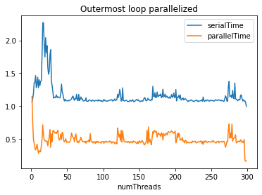
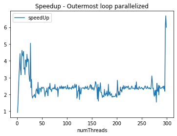
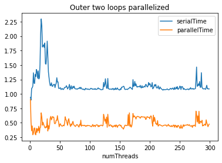
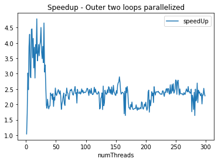
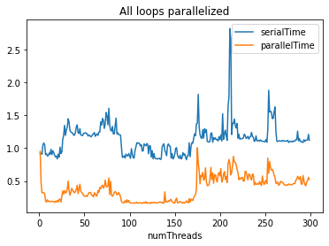
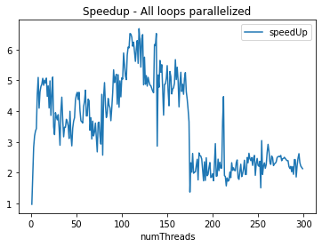

## Computing matrix-matrix product

Openmp is used to implement the algorithm for matrix multiplication.

- The serial algorithm executes in `O(n^3)` time
- There are three cases handled
    1. When outermost loop is parallelized
        - This is done using `#pragma omp for` directive, matrices are shared and loop's iterating variable are kept private to each thread
        - The program is run for thread numbers varying from 1 to 300 in a loop.
        - The scheduling of threads is static, each gets equal number of chunks.
        - The comparison of serial and parallel time vs number of threads, and speedup vs number of threads can be seen here
    
    
    

    2. When outer two loops are parallelized
        - This is done using `#pragma omp for` directive, with `collapse(2)` clause.The matrices are shared and loop's iterating variable are kept private to each thread
        - The program is run for thread numbers varying from 1 to 300 in a loop.
        - The scheduling of threads is static, each gets equal number of chunks.
        - The comparison of serial and parallel time vs number of threads, and speedup vs number of threads can be seen here
    
    
    

    3. When all three loops are parallelized
        - This is done using `#pragma omp for` directive, with `collapse(3)` clause.The matrices are shared and loop's iterating variable are kept private to each thread
        - The program is run for thread numbers varying from 1 to 300 in a loop.
        - The scheduling of threads is static, each gets equal number of chunks.
        - The comparison of serial and parallel time vs number of threads, and speedup vs number of threads can be seen here
    
    
    

### Some observations from above

- When the number of threads are not too much, the time taken by parallel algorithm decreases on increasing parallelism.
- When threads are large in number, maybe a lot of time is spent in context switches etc.
- The speedups increase with increasing levels of parallelism

### Instructions to run

- To run any specific case (say casea), follow these steps
    - `cd casea`
    - `gcc -o matmul matmul.c`
    - `./matmul matrixAInput.txt matrixBInput.txt > stats.csv`
    - To generate the plots,
        - run in a jupyter notebook, plotsGen.ipynb

- To generate random nxm matrix and output to a file `outputFile`, run inside casex (x = a/b/c) folder
    - `gcc -o matgen matrix_generator.c`
    - `./matgen n m outputFile`

### Dependencies

- matplotlib
- pandas
- plotly
- Openmp
- Linux kernel